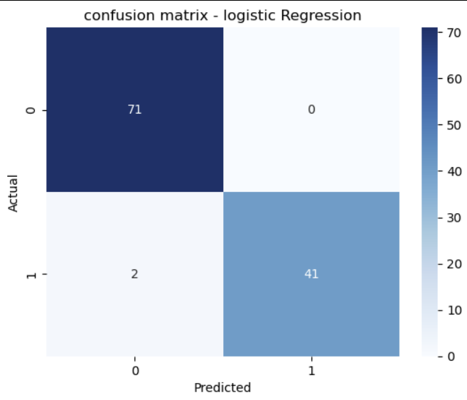
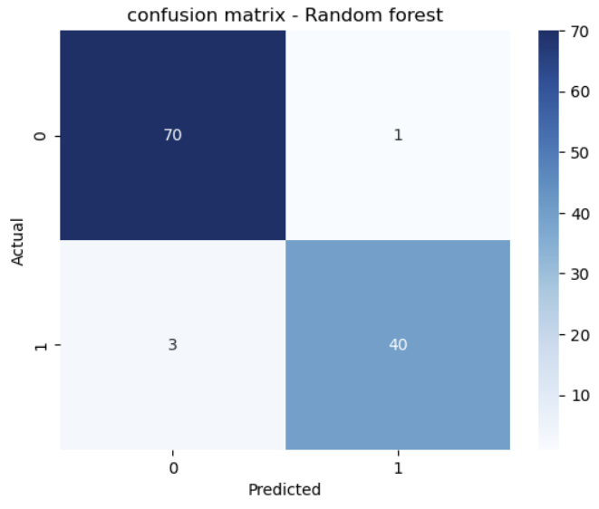

# 🧬 Breast Cancer Diagnosis with Machine Learning

This project applies classification models to diagnose breast cancer using the famous Wisconsin Diagnostic dataset. 
이 프로젝트는 위스콘신 유방암 진단 데이터셋을 이용해 유방암을 예측하는 머신러닝 모델을 적용한 사례입니다.

Key models used: Logistic Regression & Random Forest.
주요 사용 모델: 로지스틱 회귀, 랜덤 포레스트

## Dataset
- Source: [Kaggle - Breast Cancer Wisconsin (Diagnostic)](https://www.kaggle.com/datasets/uciml/breast-cancer-wisconsin-data)
- Features: 30 numerical measurements per tumor
            30개의 수치형 특징 (암 세포의 모양, 크기 등)
- Target: Diagnosis (B = Benign, M = Malignant)
                    (B = 양성, M = 악성)

## Models & Results

| Model | Accuracy | Recall (Malignant) | Precision (Malignant) |
|-------|----------|---------------------|------------------------|
| Logistic Regression | **98.2%** | 0.95 | 1.00 |
| Random Forest       | 96.5%   | 0.93 | 0.98 |

## Confusion Matrices

  
  

## Key Learnings
- Logistic Regression showed slightly better performance for this dataset.
- 로지스틱 회귀가 이 데이터셋에선 성능이 더 좋았음
- Random Forest had more False Negatives (missed cancer cases), which is risky in medical use.
- 의료 데이터에서는 암 환자를 놓치는 False Negative가 매우 위험함
- Feature scaling improved linear model performance.
- 정규화를 통해 선형 모델의 성능이 향상됨

## Tools Used
- Python (Pandas, Numpy, Scikit-learn, Seaborn, Matplotlib)
- Jupyter Notebook
